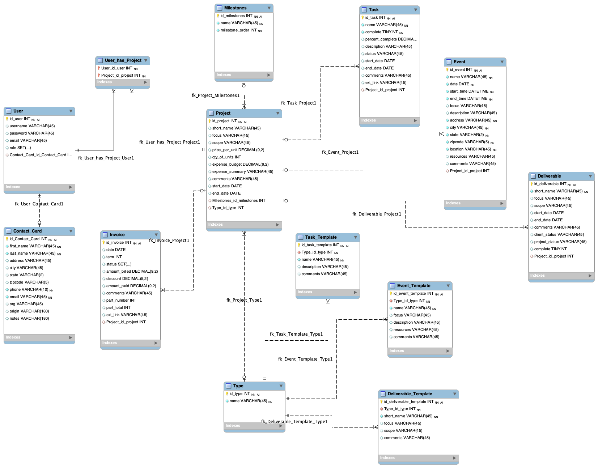

<!-- # Video Project Suite: ReadMe -->

> #### Current Progress:
> Building out foundation of application with systems for scalability in place with the first features.

## Project Overview

### Introduction

Video Project Suite is a web application that manages projects and resources for a video production company.  The business owner or producer manages multiple projects with multiple deliverables (videos), as well as shoot days, video editing, invoicing, and to do lists.  In addition, the business owner's clients use the application to enter information as well as approve video edits as well as collaborators such as video editors, who can update their progress editing videos, enter links to videos ready for review, or enter relevant information.  

This application can be generalized to other creative service and/or delivery based companies such as photographers or visual artists or even general contractors.

Video Project Suite is a modern full stack web application that works in the browser or on mobile devices with responsive web design.  The backend web api is built with .NET Core, the database is a SQL database using PostgreSQL, and the front end web interface is built using React and Material UI.  The application is built to scale using containers, monitoring, CI/CD pipelines, version control branching and robust testing.

#### Profesional Development Course
Learning .NET Core and building out the first layers of this application with professional technologies and practices in mind was part of my self guided professional development course.  For more information, you can visit my [project blog]({{ site.baseurl }}) where I wrote weekly blog posts on this process as well as my project proposal and other documents. (This overview exists both on the blog and in the github repository for the application).  The first features completed for the professional development were a projects module with user authentication and authorization.

#### Why This Project
This project is important to me because it sits at the intersection of what I want to build and how I want to grow as a developer. It gives me the opportunity to create a real software tool for a small business while expanding my technical skillset in a focused and meaningful way.

What originally drew me to software engineering was the idea of building practical, custom tools that help small businesses thrive. This project brings that goal to life. By designing and delivering a solution for a real client — someone I know and whose business needs I understand — I’m taking a tangible step toward launching myself as a software developer with a focus in serving small businesses.

#### Why This Tech Stack
* **.NET Core** has a dual appeal:  It's enterprise-ready, robust, scalable, with Microsoft backing it with extensive documentation while also small business and start up friendly, open source, cross-platform, cost-effective hosting.  .NET Core can truly grow with a business as it scales.

* **React** is ubiquitous, business-friendly, future-proof with a large talent pool and community.  Incorporating **Material UI** component library allows for fast development and confidence that the UI is consistent and high quality.

* **PostgreSQL** is open source, robust, and feature rich.  **SQLite** for development for ease of use.

* **Docker** containerization provides consistent deployment environments and easy scaling making it simple to deploy anywhere. 


### Users

There are four different type of users, Admin, Producer, Client, Collaborator (Video Editor).  

An Admin user will focus solely on setting up user roles and assigning users to projects.  The admin user is assumed to be the business owner.  A producer user will have full access with all modules.  While the business owner is likely also the producer, this division allows the business owner to outsource the role of producer. 

Client users will only have access to the projects assigned to them and interact with those projects in a dedicated client interface.  

Collaborators, such as video editors, will also only see the projects assigned to them in a dedicated collaborator interface.

For more on user stories [click here]({{ site.baseurl }}/design_pages/userstories)

### Features

#### 1. User Authentication and Roles
At the core of this application is the way the user interacts with projects based on the permissions and assignments given.  An admin user will manage these permissions and assignments.
#### 2. Projects Module
An admin user may create a project and assign different users to the project.  A project is the main entity of the application and contains important information and will be referenced by subsequent modules.
#### 3. Milestones Module
Each project will have a status described as a milestone.  Projects can be viewed or filtered based on these status milestones.  For example, "In production", "In edit", or "waiting for payment."
#### 4. Tasks Module
A dynamic list of tasks will be assigned to a project.  Think of these as a Project based To Do list.  The metadata in the task will allow for filtering as well as the crucial aspect of whether the task is complete.
#### 5. Deliverables Module
A given project may have multiple deliverables.  For example, a client may receive one shoot day but require a 30 second promotional video in addition to a longer 2 minute video.  Both videos will have the same client, the same project, and will be considered deliverables each. 
#### 6. Events Module
Events will be similar to tasks but contain different information related to time constraints and locations.  An event could be a shoot day or even a meeting with a client to approve plans.  Shoot Days will have shooting schedules attached that can be shared between producers and clients.
#### 7. Invoicing Module
The Invoice entity will keep track of projects invoice status as well as multiple invoices if needed.
#### 8. Templating Module
The video production company owner might have a saved set of tasks, events, and deliverables.  Templates can be created and managed to quickly set up projects with management systems.

For a detailed list of Features, Epics and Themes [click here]({{ site.baseurl }}/design_pages/features)

### Views
Views will be separated out by user privileges and objectives.  The overall style of the application will be clean and minimal and work seamlessly across desktop and mobile devices.  All interfaces maintain a consistent navigation and styling while also optimized for each user's workflow.

Projects can be viewed in a visual kanban style organized by their status milestones so that a user can quickly see which projects are in what stage of development.  Clicking on a project will direct you to it's page where you can interact with the modules supporting that project.

Financial Health and Income can be viewed as a business dashboard tracking invoices, income, and outstanding balances.

Clients will have a sleek dashboard that provides the status of their project at a glance.  They can easily provide feedback on schedules or video edits.  

Video Editors have a productivity style multi projects layout which provides intuitive layout for project status and next steps.

To see wireframes and mock ups [click here]({{ site.baseurl }}/design_pages/views).

### Database Design
All of the entities required for the project are heavily related and thus a relational database is the obvious choice for persisting data.  This design prioritizes referential integrity and complex quiries for reporting and dashboard views.

At the heart of the database will be the Project Entity.  Project will be referenced by Task, Event, Deliverable, Project Type (for templating), as well as Invoice.  Each client may have many projects and projects may have more than one client.  Meanwhile the Milestone entity will have a one to many relationship with projects, a project may only have one milestone at a time but the same milestone (for example "in production") may be used for multiple projects.

Templating will be implemented by creating template entities that mirror their dedicated entities.



For a more detailed database breakdown [click here]({{ site.baseurl }}/design_pages/database_design)

### API Endpoints
The API follows RESTful conventions with standard HTTP methods and uses nested endpoints that reflect data relationships. For example:

```api/project/{projectid}/task/{taskid}```

The API will handle user authentication and authorization using JSON web tokens and handle consistent errors and response formats.

For a full list of the API endpoints [click here]({{ site.baseurl }}/api-endpoints)


### Testing Strategy
Utilizing practical test driven development, testing rests on a wide foundation of back end unit tests for the business logic of the application.  Integration tests  cover the API and database functionality as well as user authorization and authentication tests to ensure that a user has access to the proper resources.  Some of the testing frameworks used are xUnit for .NET Core, Jest for React.  Finally, end to end tests will cover complete user workflows.

For a full breakdown of Testing Strategy [click here]({{ site.baseurl }}/testing-strategy)


### Deployment Plan
<!-- TBD

containers, CI/CD, AWS?

For a full breakdown of deployment [click here]({{ site.baseurl }}/deployment) -->

### Architecture / System Design

### How to use the Application

### Conclusion
<!-- Focus on Best Practices across all aspects of code.  Hoping to leverage AI tools while still building an in depth project with a deep understanding. -->

<!-- ## Getting Started -->

<!-- How to use the application will go here.  Video Demos to come. Deployment information etc. -->

<!-- ### Development Process
- Structured learning with MiniProjects
- Test Driven Development
- Git Branching Strategies
- Documentation
- CI / CD Pipelines -->