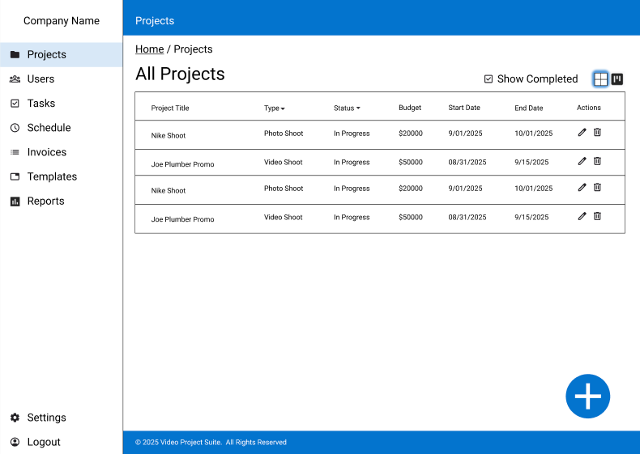
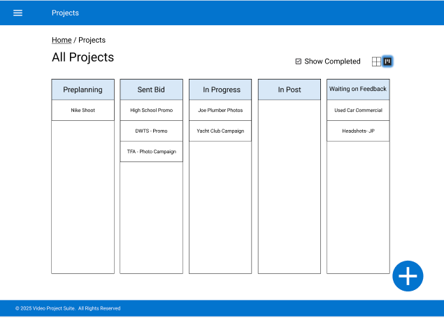
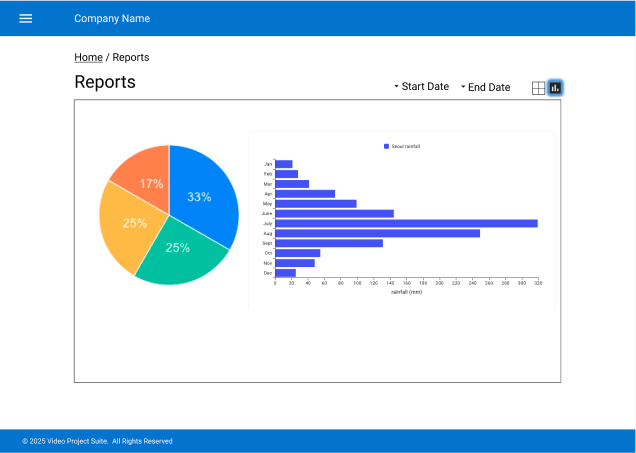
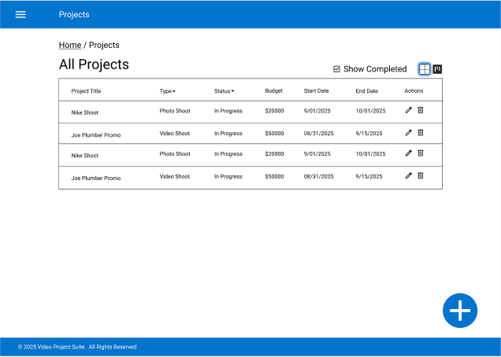
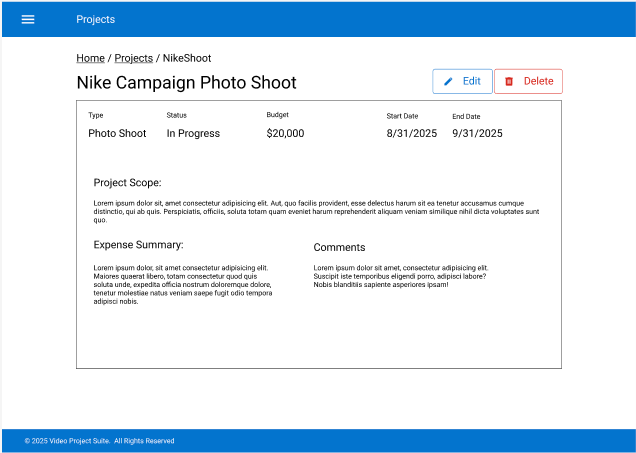

The design of the application will be minimal and leverage design elements from Material UI.  For each module there will be simple CRUD views, view all, view one in detail, create form, update form and so on.  Below are some specific views.

## Collapsable Navbar
A Navbar containing links to the application modules will open and close on the left.

## Projects Kanban View
In addition to an indexed spreadsheet style view, projects can be viewed sorted by their status in a kanban view.

## Company Reports
The Business owner can view financial health of the company based on invoices and expenses as well as new customers and completed versus incomplete projects.

## Index and Detail View
For Each module there will be a minimum of an indexed view and detail view.  More interface ideas may come about through collaboration with users.

### Index View

### Detail View

#### Project Views - Client
A Client user can view the status of their project.  Submit feedback for completed videos.  Contribute and review shooting schedules.  View invoices.

#### Project Views - Editor
An Editor can view all the video projects assigned them and can provide notes as well as update the status of each video project.

